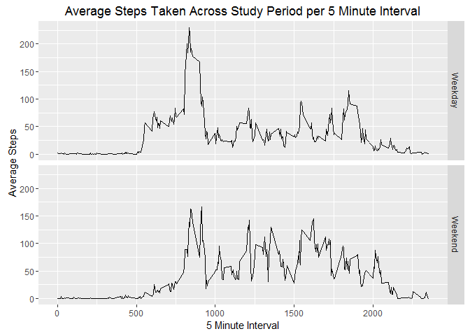

# Reproducible Research: Peer Assessment 1


## Loading and preprocessing the data  

First, the source data is read in and the date field is converted to date format.  

```r
  source<-read.csv("activity.csv")
  source$date<-as.Date(source$date, "%Y-%m-%d")
```

## What is mean total number of steps taken per day?  


```r
  library(ggplot2)
#Create a histogram of the step data
  ggplot(source)+geom_histogram(aes(x=date, weight=steps), binwidth=1)+labs(x="Date", y="Steps", title="Total Steps Taken per Day")
```

<!-- -->

```r
  #aggreate source data by day for use in calculating mean/median (aggregate function removes N/A values by default)
  totals<-aggregate(steps~date, data=source, sum)
  meant<-mean(totals$steps)
  mediant<-median(totals$steps)
```
Once the source data is aggregated by date, we see that the mean is 1.0766\times 10^{4}, and the median is 1.0765\times 10^{4}  

## What is the average daily activity pattern?  


```r
#Create a time series plot based on the five minute interval. The "stat_summary" clause is used to find the mean of each interval
  ggplot(source, aes(interval, steps))+stat_summary(fun.y="mean", geom="line", na.rm=TRUE)+labs(x="5 Minute Interval", y="Average Steps", title="Average Steps Taken Across Study Period per 5 Minute Interval")
```

<!-- -->

```r
#Aggregate the source data by five minute interval, finding the mean for each
  srcna<-na.omit(source)
  Q2<-aggregate(srcna$steps, by=list(srcna$interval), FUN=mean)
#Create a variable containing one record, with the highest mean. Calling the value of the interval field of that variable in line with the text will provide us with the 5 minute interval which on average has the maximum number of steps
  t<-subset(Q2, x==max(Q2$x))
```
The five minute interval with the greatest average daily number of steps is 835.  

## Imputing missing values  


```r
#Count the total number of missing records
  totalNA=sum(is.na(source$steps))
  library(dplyr)
```

```
## 
## Attaching package: 'dplyr'
```

```
## The following objects are masked from 'package:stats':
## 
##     filter, lag
```

```
## The following objects are masked from 'package:base':
## 
##     intersect, setdiff, setequal, union
```

```r
#Create a function to impute the mean of a set of values
  impute.mean <- function(x) replace(x, is.na(x), mean(x, na.rm = TRUE))
#Impute missing values, replacing with mean of that specific interval
  SrcImpute <- source %>% 
    group_by(interval) %>% 
      mutate(steps=impute.mean(steps))
#Save a copy of the result into a new file
  write.csv(SrcImpute, file="activity_imputed.csv")
#Plot a histogram of the totals
  ggplot(SrcImpute)+geom_histogram(aes(x=date, weight=steps), binwidth=1)+labs(x="Date", y="Steps", title="Total Steps Taken per Day")
```

<!-- -->

```r
#Aggreate source data for calculating mean/median
  totalsImpute<-aggregate(steps~date, data=SrcImpute, sum)
  meantI<-mean(totalsImpute$steps)
  mediantI<-median(totalsImpute$steps)
```
The total number of missing values is 2304. Missing values will be imputed based on the mean value for that five-minute interval. The impute mean function is one written by [Hadley Wickham](http://www.mail-archive.com/r-help@r-project.org/msg58289.html), which tests a value to see if it's "n/a", and if so replaces it with the mean for that field. If combined with the dplyr package and applied after grouping by the intervals we're able to replace the missing values with the average for the interval (based on a suggestion [here](http://stackoverflow.com/questions/9322773/how-to-replace-na-with-mean-by-subset-in-r-impute-with-plyr)).  

After imputing, the mean of the total daily steps is 1.0766\times 10^{4}, and the median is 1.0766\times 10^{4}. There are slight changes, but imputing based on the average value for a five-minute interval does not appear to significantly impact the mean and median total values.   

## Are there differences in activity patterns between weekdays and weekends?  


```r
#Create a new field, "Day", which contains the name of the day of the week for each date
  SrcImpute$Day=weekdays(SrcImpute$date)
#Create a new field, "WE", which is filled with "Weekend" if the Day field is Saturday/Sunday, or "Weekday" if not
  SrcImpute$WE=ifelse(SrcImpute$Day %in% c("Saturday", "Sunday"), "Weekend",   "Weekday")
#Create a time series of the data, split by weekday/end status
  ggplot(SrcImpute, aes(interval, steps))+stat_summary(fun.y="mean", geom="line", na.rm=TRUE)+labs(x="5 Minute Interval", y="Average Steps", title="Average Steps Taken Across Study Period per 5 Minute Interval")+facet_grid(WE~.)
```

<!-- -->

There do appear to be differences in the activity patterns between weekdays and weekends.  
